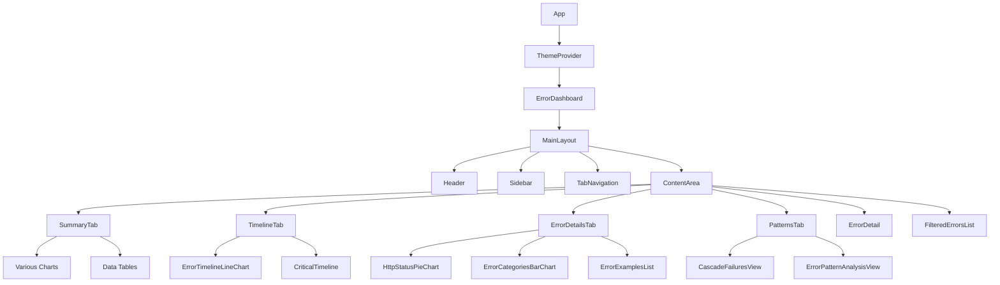
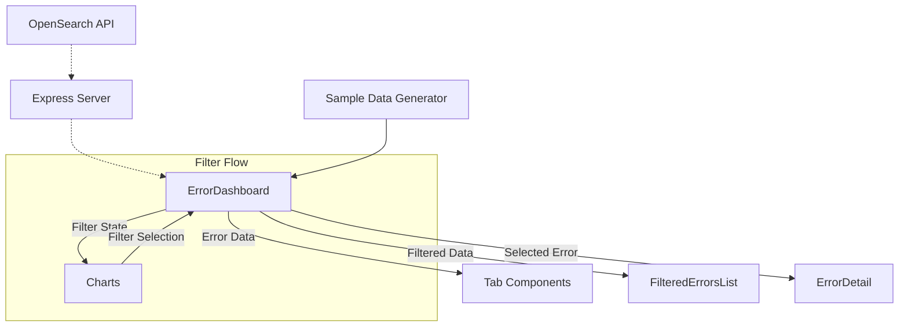

# System Patterns: Error Dashboard

## Architecture Overview

The Error Dashboard is built using a component-based architecture following React best practices. The application is structured around a hierarchical component model with clear separation of concerns.

## Component Structure

### Core Application Flow
1. **App.tsx**: The root component that wraps the application with ThemeProvider
2. **ThemeProvider.tsx**: Provides theme context and functionality to the entire application
3. **ErrorDashboard.tsx**: The main orchestration component managing state and data flow
4. **MainLayout.tsx**: Handles the overall layout structure with header, sidebar, and content area

### Content Organization

The dashboard is organized into a tab-based structure:

- **SummaryTab**: Overview of error data with multiple visualization types
- **TimelineTab**: Time-based analysis of errors
- **ErrorDetailsTab**: Detailed breakdown of error categories and examples
- **PatternsTab**: Analysis of error patterns and cascade failures

Each tab contains multiple components that visualize specific aspects of the error data.

## Data Flow Patterns

### Key Data Flows

1. **Data Sourcing**: 
   - Currently using generated sample data
   - Will eventually fetch data from OpenSearch API via Express backend

2. **State Management**:
   - Central state managed in ErrorDashboard.tsx
   - Data filtering and selection handled in the main component
   - Filtered/processed data passed down to appropriate visualization components

3. **Filter Application**:
   - User interactions with charts/tables trigger filter updates
   - Filters are applied centrally and affect all visualizations
   - Active filters are displayed through the ActiveFilters component

## Design Patterns

### Component Patterns

1. **Container/Presentation Pattern**:
   - Container components (like ErrorDashboard) manage state and data
   - Presentation components (charts, tables) focus on rendering

2. **Composition Pattern**:
   - Complex UIs built by composing smaller, focused components
   - MainLayout composes the overall structure from header, sidebar, and content

3. **Conditional Rendering**:
   - Dynamic content display based on state (active tab, filters, detail view)

### State Management Patterns

1. **Lifting State Up**:
   - Filter state and selections managed at ErrorDashboard level
   - Changes propagate down through props

2. **Custom Hooks**:
   - `useThemeColors` encapsulates theme-related functionality
   - Future API integrations will likely use custom hooks

## Component Communication

1. **Props Passing**:
   - Primary method of passing data down the component tree
   - Event handlers passed down for lifting state changes back up

2. **Context API**:
   - Used for theme management via ThemeProvider
   - Potential for additional contexts if needed (e.g., for API integration)

## UI Patterns

1. **Card-based Layout**:
   - Information sectioned into card components for clear visual separation
   - Consistent card styling across the application

2. **Interactive Visualization**:
   - Charts respond to user interaction for filtering
   - Hover states provide additional information

3. **Tab Navigation**:
   - Content organized into logical tabs
   - Tab content only loaded when the tab is active

## Error Handling Patterns

Currently focused on UI development with plans to implement:

1. **API Error Handling**:
   - Try/catch patterns for API requests
   - Error states in UI for failed data fetches

2. **Loading States**:
   - Loading indicators during data fetching
   - Skeleton UI during component loading

## Technical Implementation Notes

1. **Styling Approach**:
   - Tailwind CSS for utility-based styling
   - ShadCN components for consistent UI elements
   - CSS variables for theming
   - Direct CSS for complex styling needs

2. **Chart Rendering**:
   - Using chart libraries with React wrappers
   - Customized with theme colors

3. **Data Processing**:
   - Utility functions for data transformation and filtering
   - Centralized in utility files for reusability
